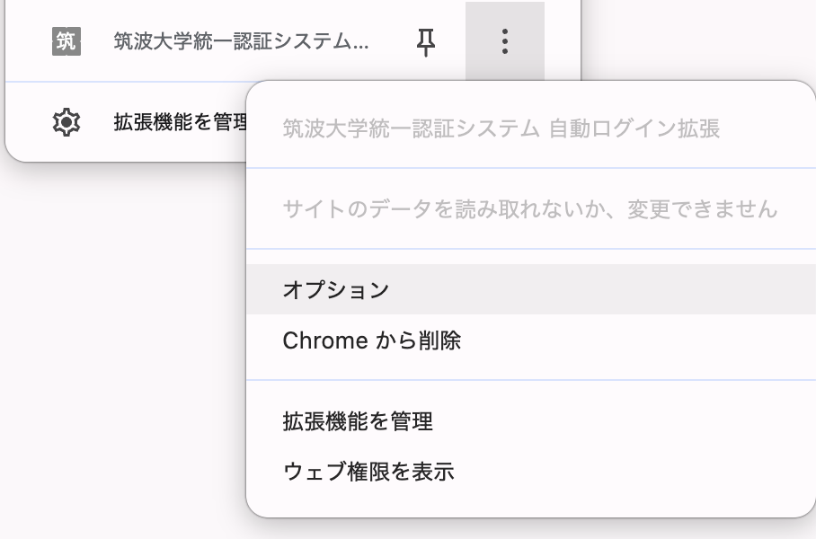

# University of Tsukuba Unified Authentication Auto-Login Extension

[日本語版](./README.md)

A Chrome extension that automatically fills in the University of Tsukuba unified authentication system.

## Installation

1. Clone or download this repository
2. Open `chrome://extensions/` in Chrome browser
3. Enable "Developer mode" in the top right corner
4. Click "Load unpacked"
5. Select the root directory of this project

## Usage

### Initial Setup

1. Find this extension in Chrome's extension list
2. Click "Options" or "Details" to open the settings page
3. Enter the following information:
   - **UTID-13**: 13-digit UTID-13 (e.g., `0012026099999`)
   - **UTID-NAME**: UTID-NAME (e.g., `s2609999`)
     - Use the "Auto-fill from UTID-13" button to generate it automatically
   - **Password**: Your unified authentication system password
4. Click the "Save" button

### Login

After configuration, the extension will automatically fill in your login information on the following pages:

- University of Tsukuba Unified Authentication System login pages (manaba, etc.)
- TWINS
- College of Information Science account login pages

## Security

- The password you enter will not be sent to the extension developer
- If you have Chrome sync enabled, it may be stored associated with your Google account
- Passwords are stored in Chrome's extension storage

## License

MIT License

## Screenshot

